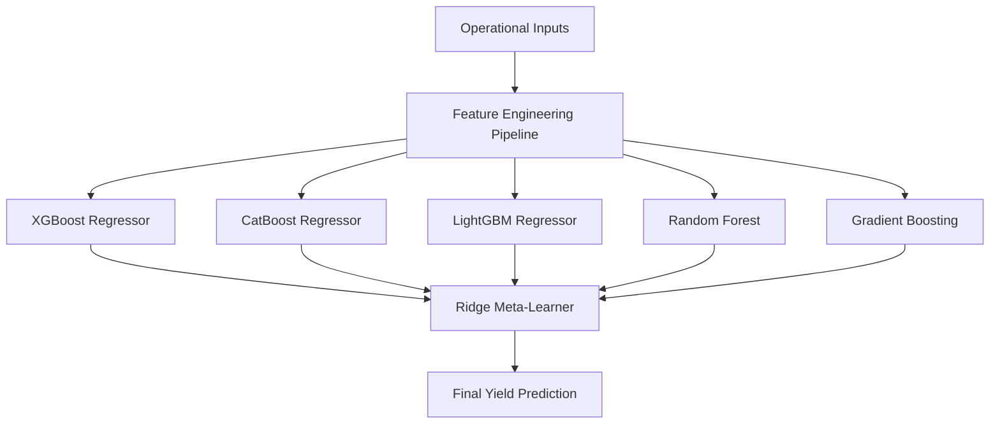

# 🍽️ PrepNova

### Precision Yield Intelligence for Industrial Food Service Operations.

[](https://prepnova-ui.onrender.com)


---

## 🚀 Scientific Overview
PrepNova is a high-fidelity operational forecasting engine designed to mitigate the **$1 Trillion global food waste crisis**. By synthesizing multi-vector environmental signals—including meteorological trends, holiday stochasticity, and historical consumption patterns—PrepNova provides a precision intelligence layer that optimizes production yields in high-volume dining environments.

### The Research Objective
Traditional food service relies on heuristic "best guesses," leading to significant overproduction or stockouts. PrepNova researches the correlation between external environmental vectors and human consumption behavior, utilizing a **Stacking Ensemble Meta-Learner** to minimize variance and operational drift.

---

## 🔬 Research & Methodology
PrepNova's intelligence loop is built on a sophisticated machine learning pipeline designed for high-uncertainty environments.

### 1. Multi-Vector Feature Engineering
The system transforms raw operational data into high-dimensional feature arrays:
*   **Environmental Vectoring:** Real-time weather impact scoring (Scored 0.6–1.0).
*   **Temporal Cyclical Encoding:** Transforming `Day_of_Week` into Sine/Cosine signals to capture 7-day periodicity.
*   **Interaction Matrices:** Analyzing the synergy between expected footfall and cultural festivals.
*   **Stochastic Lag Analysis:** Comparing previous-day consumption against same-day historical means.

### 2. Model Architecture: Stacking Ensemble
PrepNova orchestrates a diverse set of regression models to capture non-linear demand patterns:



### 3. Intelligence Stack
*   **Base Estimators:** XGBoost, CatBoost, LightGBM, Random Forest, Gradient Boosting.
*   **Meta-Estimator:** L2-Regularized Ridge Regression (to minimize overfitting in the final synthesis).
*   **Preprocessing:** Robust scaling and Label Encoding for categorical convergence.

---

## 📊 Performance & Diagnostics
The system is continuously verified against a verified ledger of actual consumption.

| Metric | Target | Current Performance |
| :--- | :--- | :--- |
| **Mean Absolute Error (MAE)** | < 30.0 | **22.87** |
| **R² Score (Coefficient of Det.)** | > 0.80 | **0.83** |
| **Root Mean Squared Error** | - | **27.95** |

> [!NOTE]
> Performance metrics are derived from a 1,000-row synthetic dataset capturing one year of operational history.

---

## ✨ System Features
- 🌲 **Predictive Yield Intelligence** — Algorithmic precision for menu planning.
- ⚡ **Zero-Drift Ensemble** — Combines 6 specialized ML architectures for robust forecasting.
- 📊 **Operational BI Dashboard** — Interactive visualization of weekday trends and weather impacts.
- 📓 **Verified Operational Ledger** — Blockchain-inspired data logging to track prediction accuracy.
- 🎨 **Executive UI Aesthetic** — High-density, premium dashboard designed for rapid industrial scanning.

---

## 🛠 Technology Stack

| Category | Component |
| :--- | :--- |
| **Backend Core** | Flask (Python 3.9+), SQLite |
| **Frontend Engine** | React 19, Vite, Tailwind CSS 4 |
| **Intelligence Layer** | Scikit-learn, XGBoost, LightGBM, CatBoost |
| **Visual Analytics** | Chart.js, Motion One |
| **Deployment** | Render (CI/CD Pipeline) |

---

## 📸 Intelligence Interface

### 🏗️ Decision Support Home


### 📊 Performance Analytics


---

## ⚙️ Deployment & Installation

### Local Setup
```bash
git clone https://github.com/nikhilmanvi360/prepnova.git
cd prepnova
python3 -m venv .venv && source .venv/bin/activate
pip install -r requirements.txt
./run_app.sh
```

### Remote Access
The platform is accessible via our production clusters:
- **Client Interface:** [https://prepnova-ui.onrender.com](https://prepnova-ui.onrender.com)

---

## 🎯 Strategic Use Cases
- **Corporate Cafeterias:** Scaling prep based on hybrid-work weather patterns.
- **University Campus Dining:** Managing surge capacity during festivals.
- **Hospitality Supply Chains:** Synchronizing inventory with local event clusters.

---

## 🤝 Contributing
1. Fork the Project
2. Create your Feature Branch (`git checkout -b feature/AmazingFeature`)
3. Commit your Changes (`git commit -m 'Add some AmazingFeature'`)
4. Push to the Branch (`git push origin feature/AmazingFeature`)
5. Open a Pull Request

---

## 📜 License
Distributed under the MIT License. See `LICENSE` for more information.

---

## 💡 Author
**Nikhil Manvi**
[GitHub Profile](https://github.com/nikhilmanvi360)

*Eliminating operational drift, one prediction at a time.*
