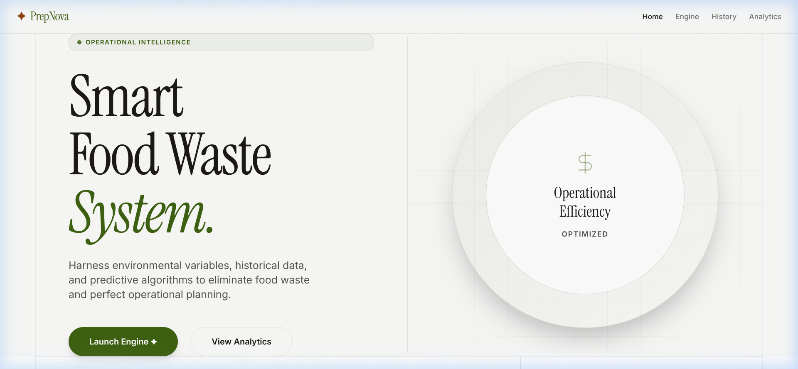
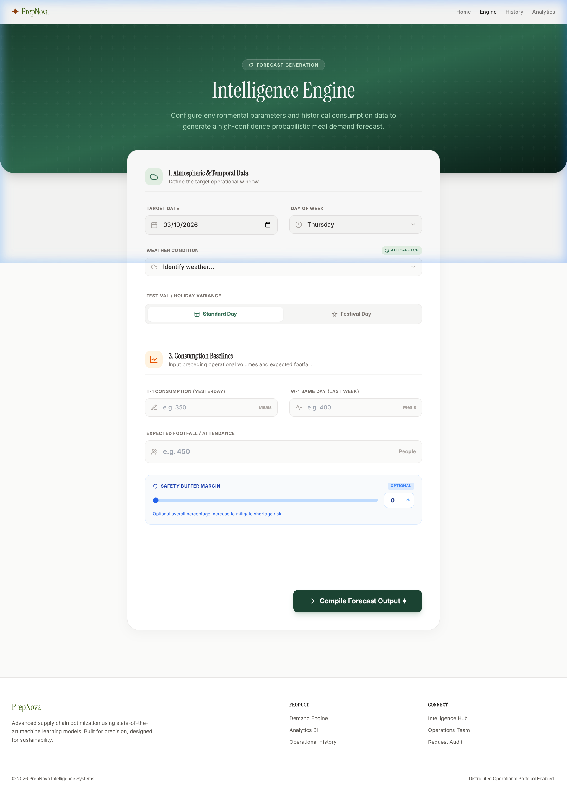
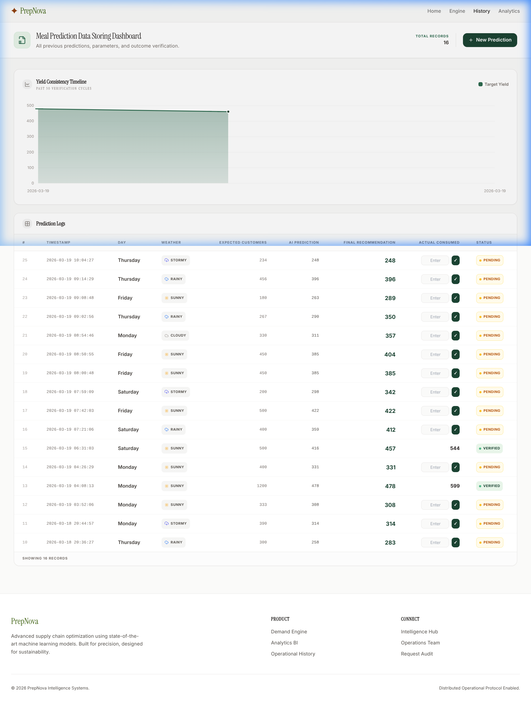

# 🍽️ PrepNova

### Eliminate Operational Drift with Predictive Yield Intelligence.


---

## 🚀 Overview
PrepNova is an elite operational forecasting engine designed for high-volume food service environments. It bridges the gap between environmental variables and kitchen production, using advanced machine learning to solve the **$1 Trillion food waste problem.**

**The Problem:** Overproduction caused by guessing demand leads to massive financial loss and environmental decay.
**The Solution:** A precision intelligence layer that aggregates weather vectors, holiday signals, and historical flow to generate bulletproof production targets.

---

## ✨ Features
- 🌲 **Predictive Yield Intelligence** — Forecast exact meal volumes with algorithmic precision.
- ⚡ **Ensemble Forecasting** — Orchestrates 6 ML models (XGBoost, CatBoost, etc.) for zero-drift accuracy.
- 📊 **Operational Analytics** — Interactive visualization of weekday trends, weather impact, and festival variance.
- 📓 **Verified Ledger** — A data-storing dashboard to track predictions against actual consumption.
- 🌦️ **Environmental Vectoring** — Automatically adjusts logic based on real-time weather and holiday data.
- 🎨 **Farm UI Aesthetic** — A premium, high-density dashboard designed for rapid operational scanning.

---

## 🧠 How It Works
PrepNova functions as a continuous intelligence loop:

1.  **Ingestion:** Collects operational inputs (footfall, weather, day category).
2.  **Processing:** Feeds data into a **Stacking Ensemble Meta-Learner** combining 5 specialized models.
3.  **Refinement:** Applies safety buffers and anomaly detection logic to the raw AI output.
4.  **Action:** Delivers a final recommendation and logs it to the **Operational Ledger** for post-event verification.

---

## 🛠 Tech Stack

| Category | Tech |
|----------|------|
| **Backend** | Flask (Python), SQLite, Jinja2 |
| **Frontend** | React 19, Vite, Tailwind CSS 4, Motion One |
| **Intelligence** | Scikit-learn, XGBoost, LightGBM, CatBoost |
| **Visualization** | Chart.js, Lucide Icons |
| **DevOps** | Shell Scripting, Git |

---

## 📸 Screenshots / Demo

### 🏗️ Intelligence Home Page


### ⚙️ The Forecast Engine (Predict)


### 📊 BI Analytics Dashboard


### 📓 Operational History Ledger


---

## ⚙️ Installation

### 1. Set Up Environment
```bash
git clone https://github.com/nikhilmanvi360/prepnova.git
cd prepnova
python3 -m venv .venv
source .venv/bin/activate
pip install -r requirements.txt
```

### 2. Launch Backend & Core UI
```bash
chmod +x run_app.sh
./run_app.sh
```

### 3. Launch React Frontend (Optional)
```bash
cd frontend
npm install
npm run dev
```

---

## 📂 Project Structure
```text
prepnova/
├── app/                # Core Flask server, routes, and Jinja templates
├── frontend/           # Modern React/Vite UI components
├── models/             # Serialized ML Stacking Ensembles (.pkl)
├── data/               # Training datasets and generation scripts
├── notebooks/          # ML research, training docs, and diagnostics
└── run_app.sh          # One-touch operational startup
```

---

## 🎯 Use Cases
- **Corporate Cafeterias:** Optimize lunch prep based on remote-work patterns and weather.
- **University Dining:** Scale production for semester-start surges and festival weeks.
- **Hospitality Hubs:** Synchronize supply chains with local event calendars.

---

## 🧪 Future Improvements
- [ ] **IoT Sensor Integration** — Real-time bin weight logging for automated verification.
- [ ] **Dynamic Retraining** — Automatic model weight adjustments based on ledger drift.
- [ ] **Inventory API** — Direct connection to supply chain providers for automated ordering.

---

## 🤝 Contributing
1. Fork the Project
2. Create your Feature Branch (`git checkout -b feature/AmazingFeature`)
3. Commit your Changes (`git commit -m 'Add some AmazingFeature'`)
4. Push to the Branch (`git push origin feature/AmazingFeature`)
5. Open a Pull Request

---

## 📜 License
Distributed under the MIT License. See `LICENSE` for more information.

---

## 💡 Author
**Nikhil Manvi**
[GitHub Profile](https://github.com/nikhilmanvi360)

*Eliminating waste, one prediction at a time.*
